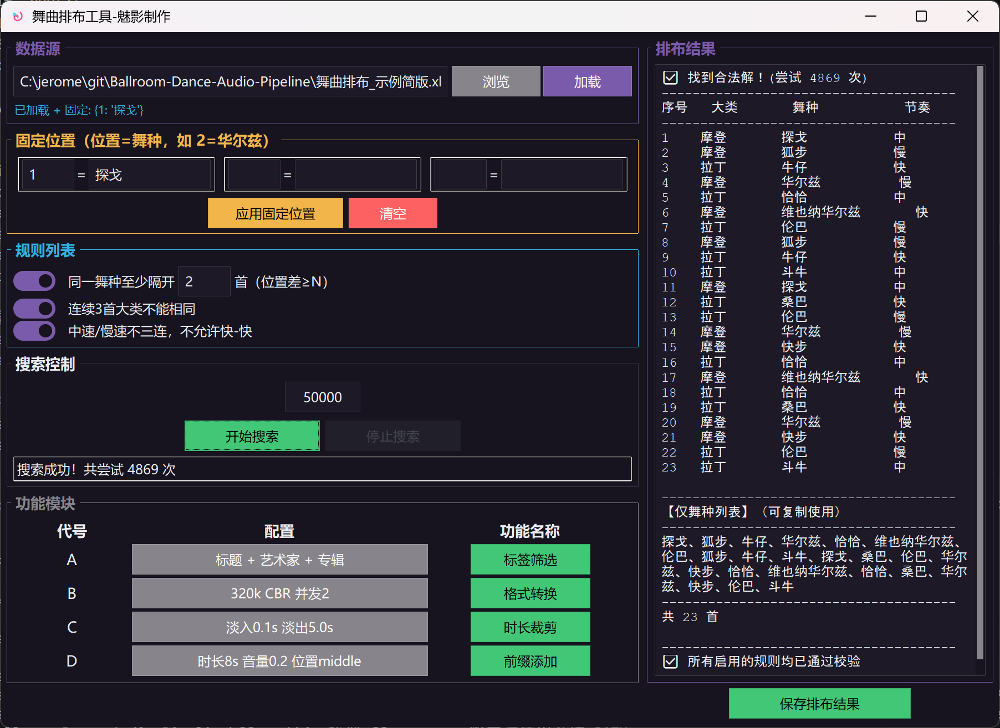

[](./images/wechat_pay.jpg?raw=true)

# Ballroom-Dance-Audio-Pipeline

## 界面预览



# 🎵 舞曲排布工具 - 魅影制作
> 智能舞曲播放列表排布工具，让每一场舞蹈都完美流畅

## 📖 目录
- [项目简介](#项目简介)
- [主要功能](#主要功能)
- [技术栈](#技术栈)
- [安装与运行](#安装与运行)
- [使用说明](#使用说明)
- [数据格式](#数据格式)
- [算法原理](#算法原理)
- [常见问题](#常见问题)
- [开发计划](#开发计划)

## 项目简介

舞曲排布工具是一款基于 Python Tkinter 开发的桌面应用程序，专门用于舞曲播放列表的智能排布。该工具通过随机搜索算法，自动为舞曲生成符合特定规则的最优播放顺序，特别适合舞蹈活动、舞会等场景的曲目编排。

## 主要功能

### 1. 数据管理
- 支持从 Excel 文件加载舞曲数据
- 内置示例数据，开箱即用
- 可视化的舞种列表管理

### 2. 舞种配置
- 支持多种舞种分类（摩登舞、拉丁舞等）
- 每个舞种可独立设置数量
- 显示舞种名称、类别和速度属性

### 3. 智能排布算法
采用随机搜索策略，支持以下核心规则：
- **同一舞种间隔**：相同舞种至少隔开6首
- **类别多样性**：连续3首不能属于同一大类
- **速度平衡**：中速/慢速不三连，不允许快-快连续

### 4. 交互控制
- 可调节搜索次数（默认50000次）
- 实时显示搜索进度和最佳得分
- 支持随时停止搜索
- 独立的规则开关，灵活调整约束条件

### 5. 结果展示
- 按舞种大类分组显示排布结果
- 显示每首舞曲的名称和速度
- 展示方案得分和总曲目数

## 技术栈

- **Python 3.x** - 核心语言
- **Tkinter** - GUI 框架
- **Pandas** - Excel 数据读取
- **Threading** - 多线程搜索

## 安装与运行

### 环境要求
```bash
Python 3.8+
pip install pandas openpyxl
```

# 快速启动
```bash
# 1. 克隆仓库
git clone https://github.com/jerome-757/Ballroom-Dance-Audio-Pipeline.git
# 2. 进入目录
cd Ballroom-Dance-Audio-Pipeline
# 3. 安装依赖
pip install -r requirements.txt
# 4. 运行程序
python dance_arrangement_main.py
```

# 使用说明

## 基础操作流程

### 1.加载数据
- 默认使用内置示例数据
- 或点击"加载"按钮从 Excel 文件导入

### 2.设置舞曲数量
- 在舞种列表中，通过数字输入框调整每首舞曲的数量
- 数量为0表示不包含该舞曲

### 3.配置规则
- 勾选/取消勾选规则复选框来启用或禁用特定约束
- 所有规则默认启用

### 4.开始搜索
- 设置搜索次数（建议10000-100000次）
- 点击"开始搜索"按钮
- 观察状态栏的实时进度

### 5.查看结果
- 搜索结果自动显示在"排布结果"区域
- 按舞种大类分组展示
- 显示方案综合得分

# 规则说明

| 规则 | 说明 | 默认状态 |
|:---|:---|:---|	            	                    
| 同一舞种至少隔开6首	| 相同舞种在播放列表中的位置间隔≥6	| ✅ 启用 |
| 连续3首大类不能相同	| 任何连续的3首舞曲不能属于同一大类	| ✅ 启用 |
| 中速/慢速不三连，不允许快-快	| 限制速度模式的连续重复	| ✅ 启用 |

# 数据格式

## Excel 文件格式要求

| 列名 | 说明 | 示例 |
|:---|:---|:---|	 	
| category	| 舞种大类	| 摩登舞 |
| name	| 舞种名称	| 华尔兹 |
| speed	| 速度属性	| 慢/中/快 |
| count	| 数量	| 1 |

## 内置示例数据

程序内置了30多个舞种的示例数据：
- 摩登舞：华尔兹、维也纳华尔兹、探戈、狐步、快步
- 拉丁舞：伦巴、恰恰、桑巴、牛仔、斗牛
- 地方舞：三步踩、平四
- 交谊舞：慢三、慢四、并四、水兵舞、鬼步舞、吉特巴、点帕斯、休闲伦巴、中三、中四、快四
- 集体舞：兔子舞、十六步、三十二步、DJ
- 网红舞：汉舞、唐舞、周舞
  
# 算法原理

## 搜索策略

采用随机搜索算法，通过多次随机排列组合，评估每个排列的适应度分数，保留最优方案。

## 评分机制

- 每个规则对符合条件的排列给予加分
- 违反规则会扣减分数
- 最终得分为所有规则评分的累加（最低为0）
- 得分越高，方案越优

## 性能优化

- 使用多线程避免界面卡顿
- 每1000次尝试更新一次状态
- 发现完美方案（得分100）时提前终止

# 常见问题

## Q: 为什么搜索不到满意的方案？
### A: 可以尝试：
- 增加搜索次数
- 适当放宽规则（取消部分规则）
- 减少特定舞曲的数量

## Q: 如何从Excel导入数据？
### A: 准备符合格式要求的Excel文件，在"数据源"区域填写文件路径，点击"加载"即可。

## Q: 程序卡住了怎么办？
### A: 搜索过程中界面可能响应较慢，这是正常现象。可以点击"停止搜索"按钮中断搜索。

# 开发计划

- □ 完善固定位置功能
- □ 添加导出结果功能（TXT/Excel）
- □ 支持自定义规则
- □ 优化算法性能
- □ 添加进度条显示
- □ 支持拖拽调整舞曲顺序

# 📄 许可证

本项目仅供个人学习使用。

<div align="center"> <sub>Built with ❤️ by 魅影制作</sub> </div> 
